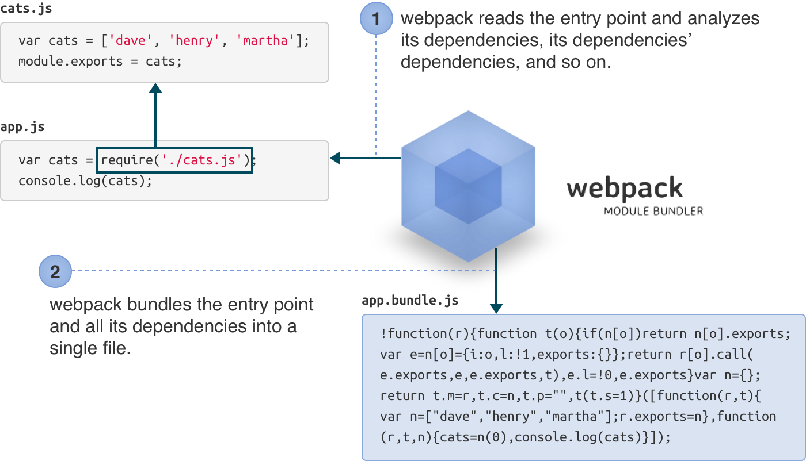

# 用法

## 安装

你可以通过npm安装webpack：

```sh
npm install webpack -g
```

> 提示：我们为了演示目的把webpack安装到全局。当你在构建一个真实应用时，安装webpack作为你的项目的一个开发依赖更加明智。

## 准备开始

首先，我们将会通过使用webpack的命令行接口学习基础的webpack。

### 创建一个模块化的JavaScript项目

让我们使用CommonJs语法在JavaScript中创建一些模块：

** cats.js **

```js
var cats = ['dave', 'henry', 'martha'];
module.exports = cats;
```

**app.js (入口点) **

```js
cats = require('./cats.js');
console.log(cats);
```

你的应用将开始于这个入口点，也是webpack将会开始在模块间跟踪依赖的地方。

### webpack 5秒

给webpack入口点(app.js)以及指定一个输出文件(app.bundle.js)：

```sh
webpack ./app.js app.bundle.js
```

webpack将会读取分析入口点以及它的依赖（包括传递的依赖），然后把他们全部打包到`app.bundle.js`。



现在你的文件已经打包好准备运行了，运行`node app.bundle.js`命令，惊叹于你的猫的丰富（输出猫的数组）。

```sh
node app.bundle.js
["dave", "henry", "martha"]
```

你也可以在浏览器里使用打包。

## 进一步

webpack是一个十分灵活的模块打包器。它提供了许多先进的特性，但不是所有的特性都暴露在命令行接口。为了获取全部的访问webpack的灵活性，我们需要创建一个“配置文件”。

### 项目结构

在真实的webpack项目里，我们将会在不同的目录中区分源文件与打包后的文件，例如，我们会把源文件放到 **src** 目录，把打完包的文件放到 **bin** 目录。

我们的最终项目结构会看起来像这样：


> 在其他地方，有许多项目结构。他们是使用 *app* 代替 *src* 目录。有些项目使用 *dist* 或者 *build* 代替 *bin* 目录。项目的测试通常使用 *test*, *tests*, *spec*, *specs* 或者 放置测试文件在源文件夹。

1. 创建 `bin` 和 `src` 目录

```sh
mkdir bin
mkdir src
```

2. 移动原始源文件到 `src` 目录

```sh
mv app.js cats.js src
```

3. 初始化 npm 项目

```sh
npm init # (answer the questions)
```

4. 安装webpack作为开发依赖，这可以让你的项目声明一个兼容的webpack版本

```sh
npm install --save-dev webpack
```

### 移动到配置文件

随着你的项目增长，你的配置文件也会变得更加复杂，它的命令行中webpack配置变得很笨拙。让我们来创建一个配置文件来替代。

1. 创建 `webpack.config.js` :

```js
module.exports = {
	entry: './src/app.js',
	output: {
		path: './bin',
		filename: 'app.bundle.js'
	}
};
```

> webpack 配置文件 CommonJS-style 模块。所以你在这里可以运行任何类型的代码，只要配置对象导出了该模块的。

2. 在配置文件的地方，你立马简单的运行 webpack 就像这样：

```sh
webpack
```

> webpack 将会读取配置文件，构建打包并保存到bin/app.bundle.js。如果你检查webpack的输出内容，你可以看到它也同时包含着源码文件。

3. 运行 bin/app.bundle.js 你可以再一次看到猫的列表数组。

```sh
node bin/app.bundle.js
["dave", "henry", "martha"]
```
> 你也可以使用 `require()` 模块通过没有额外的配置npm安装。

### 使用加载器

webpack 只支持原生的 JavaScript 模块，但是许多人会在 ES2015, CoffeeScript, TypeScript 等使用。
他们就可以使用 webpack 的 [loaders](using-loaders.html)

加载器是特殊的模块被webpack用于“加载”其他的模块（另外语言编写）到 JavaScript （webpack可以识别）。例如：`babel-loader` 使用 Babel 去加载 ES2015 文件。


`json-loader` 加载 JSON 文件 (只需通过预先 module.exports = 把它变成一个 CommonJS 的模块)。


加载器还可以是被链接的，有些时候你需要链接一些加载器到一起。例如 `yaml-Loader` 只会把 YAML 转换成 JSON，因此你需要链接 `json-loader` 这样就可以它了。 


### 使用转换 `babel-loader` 成 ES2015

在这个例子中，我们将会告诉webpack去通过 [Babel](https://babeljs.io/) 运行我们的源码文件，这样我们就可以使用 ES2015 的特性了。

1. 安装 Babel 和它的预置:

```sh
npm install --save-dev babel-core babel-preset-es2015
```

2. 安装 `babel-loader`:

```sh
npm install --save-dev babel-loader
```

3. 通过添加 `.babelrc` 配置使用预置配置 Babel。

```js
{ "presets": [ "es2015" ] }
```

4. 修改 `webpack.config.js` 使得 `babel-loader` 去处理所有 `.js` 结尾的文件。

```js
module.exports = {
    entry: './src/app.js',
    output: {
        path: './bin',
        filename: 'app.bundle.js',
    },
    module: {
        loaders: [{
            test: /\.js$/,
            exclude: /node_modules/,
            loader: 'babel-loader',
        }]
    }
}
```

> 这里我们排除 `node_modules` 目录，因为否则所有外部库将会经历 Babel 使得编译慢下来。

5. 安装你想要使用的库（这个例子中，jQuery）:

```sh
npm install --save jquery babel-polyfill
```

> 这次我们使用 `--save` 代替 `--save-dev` ，这样这些库将会在运行时被使用。我们也使用 babel-polyfill 以便 ES2015 APIs 可以在老的浏览器中可用。

6. 编辑 `src/app.js`:

```js
import 'babel-polyfill';
import cats from './cats';
import $ from 'jquery';

$('<h1>Cats</h1>').appendTo('body');
const ul = $('<ul></ul>').appendTo('body');
for (const cat of cats) {
    $('<li></li>').text(cat).appendTo(ul);
}
```

7. 用 webpack 打包模块:

```
webpack
```

8. `添加 index.html` 以便app可以运行在浏览器中:

```
<!DOCTYPE html>
<html>
    <head>
        <meta charset="utf-8">
    </head>
    <body>
        <script src="bin/app.bundle.js" charset="utf-8"></script>
    </body>
</html>
```

当你打开 `index.html`，你应该立即看到猫的列表了！


这里有若干不同的加载器你可以用包含文件到你的应用包中，包括 css 和 image 加载器。

###使用插件

通常你会想要在你的工作流中处理一些额外的流程。一个例子压缩你的文件这样使得客户端可以快速的加载。这种可以通过[插件](using-plugins.html)来完成，我们将会添加 uglify 插件到我们的配置中：

```js
const webpack = require('webpack');

module.exports = {
    entry: './src/app.js',
    output: {
        path: './bin',
        filename: 'app.bundle.js',
    },
    module: {
        loaders: [{
            test: /\.jsx?$/,
            exclude: /node_modules/,
            loader: 'babel',
        }]
    },
    plugins: [
        new webpack.optimize.UglifyJsPlugin({
            compress: {
                warnings: false,
            },
            output: {
                comments: false,
            },
        }),
    ]
}
```

这个 Uglify 插件 被包含到 webpack 以便你不再需要添加格外的模块，但是这可能不总是这样的情况。你可以写属于你自己的自定义插件。为了这个构建，这 uglify 插件把包的大小从1618字节到308字节。

## 深入阅读

- 命令行接口参考 [CLI][cli]
- node.js 接口参考 [node.js API][node.js api]
- [配置选项][configuration]

[cli]: cli.md
[node.js api]: node.js-api.md
[configuration]: configuration.md
